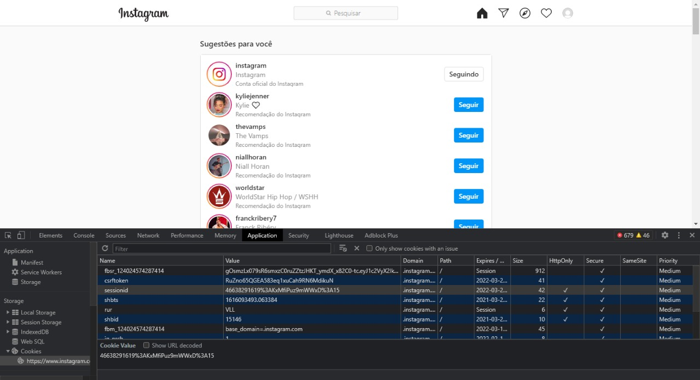

## Php Instagram Crawler

> *Api pública desenvolvida para consulta de dados do Instagram sem a 
> necessidade da autenticação por Facebook*

## Como usar 
*Primeiramente, faça um clone deste repositório*

    git clone https://github.com/matthtavares/php-instagram-crawler.git

*Depois que o repositório foi clonado, abra o instagram no browser efetue login e pegue o **sessionid** dentro do cookie.*

*Copie o sessionid e vá em tests/CrawlerTest.php e cole seu sessionid*

    protected function setUp() : void
    {
        $this->crawler = new Crawler('yoursessionid');
    }

*Depois disso execute o teste através do  terminal *

    ./vendor/bin/phpunit tests/CrawlerTest.php
 
 
*O Crawler vai trazer dados em formato JSON dentro da pasta cache que fica na pasta test*